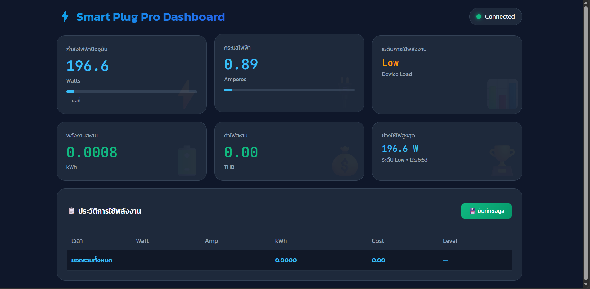
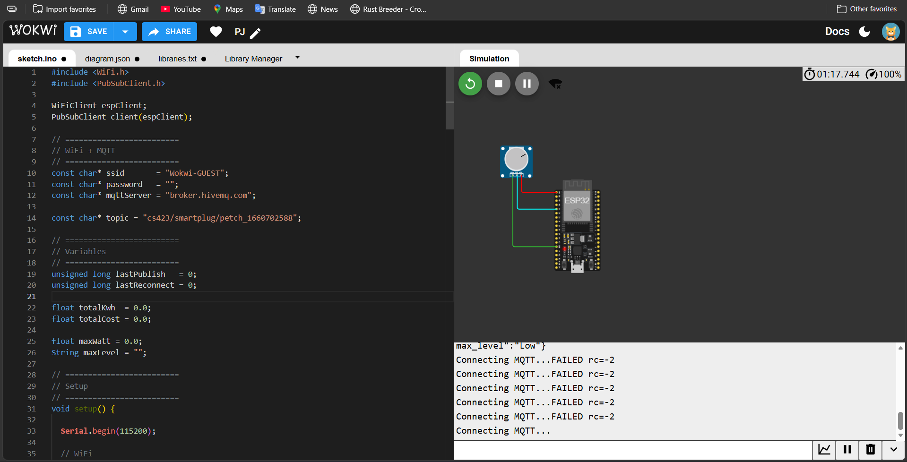

# ⚡ Smart Plug Pro Dashboard

Real-time IoT Smart Energy Monitoring System using ESP32 and MQTT Protocol

---


---

# 📌 Overview

Smart Plug Pro Dashboard เป็นระบบ IoT สำหรับตรวจวัดการใช้พลังงานไฟฟ้าของอุปกรณ์ไฟฟ้าแบบ Real-time โดยใช้ ESP32 เป็นหน่วยประมวลผลหลัก และใช้ MQTT Protocol ในการสื่อสารข้อมูลระหว่างอุปกรณ์และ Web Dashboard

ระบบสามารถตรวจสอบ:

- กระแสไฟฟ้า (Ampere)
- กำลังไฟฟ้า (Watt)
- พลังงานสะสม (kWh)
- ค่าไฟฟ้า (THB)
- ระดับการใช้พลังงาน

พร้อมทั้งบันทึกประวัติการใช้งานและแสดงผลแบบ Real-time ผ่าน Dashboard บนเว็บเบราว์เซอร์

---

# 📸 Dashboard Preview

<p align="center">
  
</p>

---

# 🔌 ESP32 Circuit

<p align="center">
  
</p>

---

# 🧠 Technologies Used

## ESP32 Side

- ESP32
- Arduino Framework
- WiFi.h
- PubSubClient.h

## Dashboard Side

- HTML5
- CSS3
- JavaScript
- MQTT.js
- HiveMQ Broker

---

# 📂 Project Structure

```bash
smartplug-project/
│
├── esp32/
│   └── smartplug.ino
│
├── dashboard/
│   └── index.html
│
├── assets/
│   ├── dashboard-preview.png
│   ├── esp32-circuit.png
│   └── architecture.png
│
└── README.md
```

---

# ⚙️ System Workflow

## ESP32 Process

ESP32 performs:

1. WiFi Connection
2. MQTT Broker Connection
3. Analog Reading from GPIO34
4. Power Calculation
5. JSON Data Transmission every 5 seconds

---

# 📡 Example JSON Payload

```json
{
  "watt": 352.4,
  "amp": 1.60,
  "level": "Low",
  "kwh": 0.0241,
  "cost": 0.11,
  "max_watt": 502.0,
  "max_level": "Medium"
}
```

---

# 📊 Dashboard Features

The dashboard supports:

- MQTT Subscribe
- Real-time Data Visualization
- Card-based UI Display
- Power Usage Detection
- Historical Usage Storage
- LocalStorage Backup
- Highest Usage Analysis

---

# 🔌 MQTT Configuration

## Broker

```text
broker.hivemq.com
```

## Topic

```text
cs423/smartplug/petch_1660702588
```

---

# 🌐 MQTT Connections

## Dashboard WebSocket

```text
wss://broker.hivemq.com:8884/mqtt
```

## ESP32 TCP MQTT

```text
broker.hivemq.com:1883
```

---

# 🧮 Power Calculation

## Power Formula

```text
Watt = Amp × 220V
```

## Energy Consumption

```text
kWh += (Watt / 1000) × Time(hours)
```

## Electricity Cost

```text
Cost = kWh × 4.5
```

---

# 📈 Power Usage Levels

| Watt Range | Level |
|---|---|
| < 100W | Standby |
| 100 - 499W | Low |
| 500 - 999W | Medium |
| 1000 - 1999W | High |
| ≥ 2000W | Very High |

---

# 🖥️ Installation Guide

## 1. Upload ESP32 Code

Install Libraries:

- WiFi
- PubSubClient

Upload:

```text
smartplug.ino
```

---

## 2. Open Dashboard

Open:

```text
index.html
```

using Browser

---

# 📱 Main Features

- Real-time Dashboard
- Animated Progress Bar
- Power Trend Analysis
- Historical Usage Table
- Highest Usage Detection

---

# 🌟 Advantages

- Lightweight System
- No Backend Server
- Mobile Friendly
- Responsive Design
- Public MQTT Broker
- Easy Deployment

---

# 🔮 Future Improvements

- Smart Relay ON/OFF
- Overload Notifications
- Database Integration
- Firebase Integration
- Node-RED Support
- Mobile Application
- Authentication System
- Energy Graph Analytics

---

# 👨‍💻 Developer

- Name: claim dee mai
- Course: CS423 IoT Project
- University: Bangkok University

---

# 📄 License

This project is for educational purposes only.
